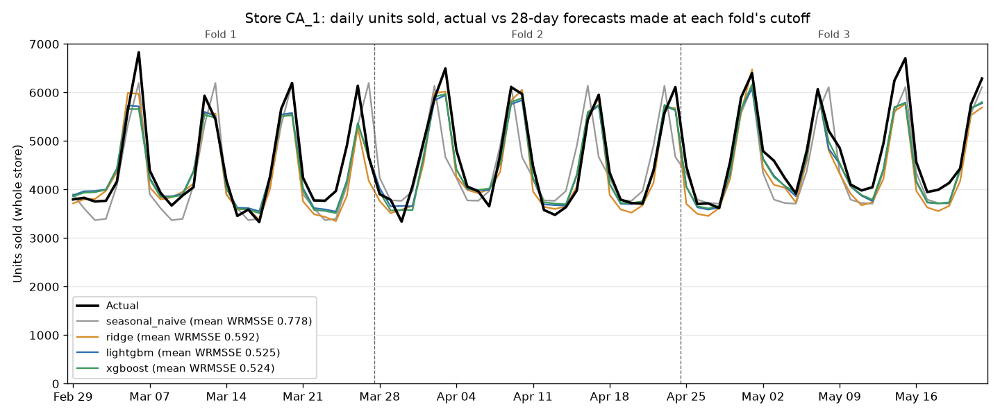
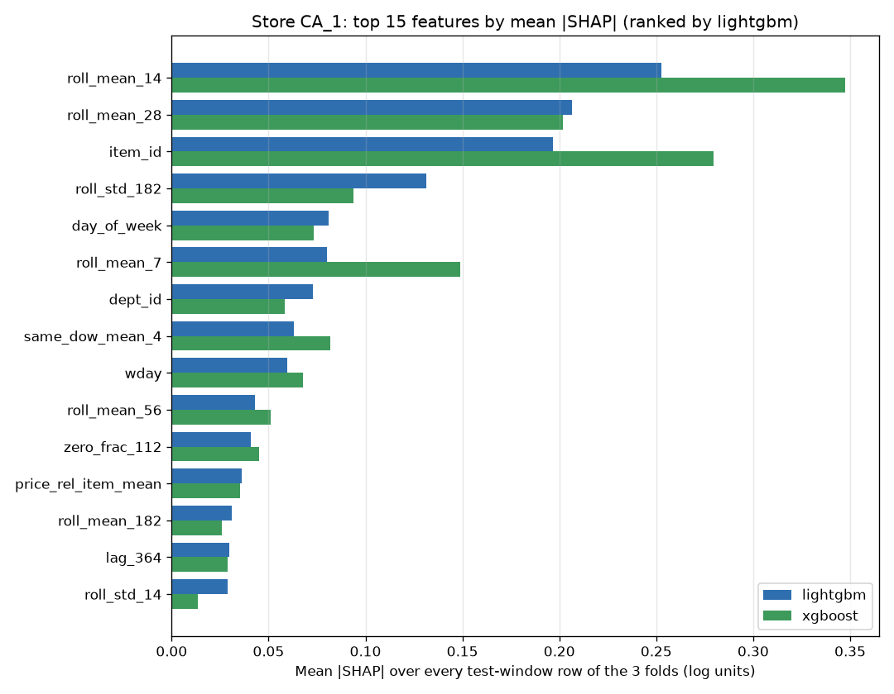

# Results and conclusions

What this project measured, how, and what it did not show. Every number on this page
sits inside a `GENERATED` region that `uv run m5-writeup` rewrites from the committed
artifacts in `results/`; `tests/test_writeup.py` fails if any of them drifts from its
artifact, or if a measured number appears in the hand-written prose around them.

## Headline

<!-- GENERATED:headline:BEGIN -->

- **xgboost** has the lowest mean WRMSSE, **0.524**, over 3 walk-forward folds on the 3,049 item series of store CA_1: **32.7% lower than the seasonal-naive baseline** (0.778).
- **lightgbm** is 0.0018 behind (0.525), too close to call either model the winner. Ridge and the hurdle model score 0.592 and 0.578; the plain linear regression (0.814) is worse than the baseline.

<!-- GENERATED:headline:END -->

## What was forecast

Daily unit sales of every product in one Walmart store, 28 days ahead, from the real
Walmart data of the Kaggle
[M5 Forecasting - Accuracy](https://www.kaggle.com/competitions/m5-forecasting-accuracy/data)
competition. Each forecast is per item and per day, the level at which a store would
order stock. The raw files are checked against pinned sha256 hashes and documented M5
facts before anything uses them ([provenance/m5_data.json](../provenance/m5_data.json)).

<!-- GENERATED:scope:BEGIN -->

- **Store CA_1** (state CA), 3,049 item series, daily sales from 2011-01-29 to 2016-05-22.
- **28-day horizon**, forecast directly from 52 features whose sales inputs are at least 28 days old.
- **3 walk-forward folds**, each training on every day up to its cutoff and forecasting the next 28 days; the last fold ends on the last day of sales:

| Fold | Train through | Forecast | Series x days scored |
| --- | --- | --- | --- |
| 1 | 2016-02-28 | 2016-02-29 to 2016-03-27 | 85,372 |
| 2 | 2016-03-27 | 2016-03-28 to 2016-04-24 | 85,372 |
| 3 | 2016-04-24 | 2016-04-25 to 2016-05-22 | 85,372 |

<!-- GENERATED:scope:END -->

## How it was evaluated

- **Walk-forward backtest.** Each fold trains only on days up to its cutoff and
  forecasts the following 28 days, as a store would on the cutoff day. The folds are
  back to back, so every model is scored on the same 12 most recent weeks.
- **The competition's metric.** WRMSSE: each series' error is scaled by how hard that
  series is to forecast (its one-step naive error in training) and weighted by its
  dollar sales, over the 12 M5 aggregation levels. Lower is better. On one store those
  levels collapse to 4 distinct ones (store total, category, department, item).
- **No look-ahead, tested.** `tests/test_leakage.py` scrambles every input after a
  cutoff and fails if any feature up to the cutoff changes. `tests/test_backtest.py`
  fails if any model's forecast changes when every sale after the cutoff is scrambled.
- **Tuning never sees the test window.** The boosted models pick their settings and
  number of trees on the last 28 days of each fold's own training data, then refit.
  The full grid and every candidate's score are in
  [results/metrics.json](../results/metrics.json).

## Model comparison

Six models in four families, on identical folds and features
([results/metrics.md](../results/metrics.md) has runtimes, the hurdle model's
classifier scores and the search results):

<!-- GENERATED:model_table:BEGIN -->

| Model | Family | Fold 1 | Fold 2 | Fold 3 | Mean WRMSSE | vs seasonal-naive | Mean MAE (units) |
| --- | --- | --- | --- | --- | --- | --- | --- |
| seasonal_naive | naive baseline | 0.7661 | 0.9075 | 0.6598 | 0.7778 | - | 1.3228 |
| linear_regression | linear | 0.8570 | 0.7976 | 0.7885 | 0.8144 | 4.7% worse | 1.1726 |
| ridge | linear | 0.6205 | 0.5351 | 0.6193 | 0.5916 | 23.9% lower | 1.1315 |
| hurdle_logistic_ridge | logistic hurdle (classifier x regressor) | 0.6045 | 0.5269 | 0.6033 | 0.5783 | 25.7% lower | 1.1429 |
| lightgbm | gradient boosting | 0.5728 | 0.4740 | 0.5292 | 0.5253 | 32.5% lower | 1.1175 |
| xgboost | gradient boosting | 0.5778 | 0.4738 | 0.5189 | **0.5235** | 32.7% lower | 1.1146 |

<!-- GENERATED:model_table:END -->

<!-- GENERATED:model_findings:BEGIN -->

- The simple linear regression on a few sales-history features is 4.7% worse than seasonal-naive (0.8144 vs 0.7778) and beats it in 1 of 3 folds. Ridge on the full feature set is 23.9% lower, so the gain comes from the full feature set, not from regression as such.
- Adding a LogisticRegression "does it sell today" stage (the hurdle model) takes Ridge from 0.5916 to 0.5783, better than Ridge in every fold.
- Both boosted models beat Ridge and the hurdle model in every fold. Even the weaker one, lightgbm, is 11.2% lower than Ridge and 9.2% lower than the hurdle model.
- Between the two boosted models the fold winners are lightgbm in fold 1, xgboost in fold 2, xgboost in fold 3: each model wins at least one fold, so 3 folds cannot separate them.

<!-- GENERATED:model_findings:END -->



The plot sums the item forecasts over the whole store. All models follow the weekly
cycle. The two boosted models lie almost on top of each other and track weekdays
closely, but fall short of the tallest weekend peaks. Seasonal-naive repeats the quirks
of its last training week: in fold 2 it copies the week of Easter Sunday, when sales
dipped, and misses every Sunday that follows.

## What drives the forecasts (SHAP)

Exact TreeSHAP values for both boosted models on every forecast row of every fold, from
models rebuilt to reproduce the backtest's scores exactly. Shares are of total mean
|SHAP|; the values are in log units because the Tweedie models forecast
log(expected units). Full tables, per fold: [results/explanations.md](../results/explanations.md).



<!-- GENERATED:shap_top:BEGIN -->

| Rank | lightgbm | share | xgboost | share |
| --- | --- | --- | --- | --- |
| 1 | roll_mean_14 | 15.5% | roll_mean_14 | 19.2% |
| 2 | roll_mean_28 | 12.6% | item_id | 15.4% |
| 3 | item_id | 12.0% | roll_mean_28 | 11.1% |
| 4 | roll_std_182 | 8.0% | roll_mean_7 | 8.2% |
| 5 | day_of_week | 5.0% | roll_std_182 | 5.2% |

Share of total mean |SHAP| by feature group:

| Group | lightgbm | xgboost |
| --- | --- | --- |
| rolling means | 41.4% | 45.9% |
| product identity | 16.7% | 19.7% |
| price | 4.2% | 3.3% |
| sales lags | 3.1% | 3.8% |
| snap | 0.4% | 0.2% |

<!-- GENERATED:shap_top:END -->

<!-- GENERATED:shap_findings:BEGIN -->

- The same three features are the top 3 in all 3 folds of both models: item_id, roll_mean_14, roll_mean_28. Only their order changes.
- The 28-day lag ranks 20th in lightgbm (1.3%) and 14th in xgboost (1.6%); sell price ranks 18th in lightgbm (1.4%) and 16th in xgboost (1.5%).
- On food rows of SNAP days the `snap` flag itself multiplies the forecast by only x1.010 and x1.005 (lightgbm and xgboost, fold 3). Day of month and recent sales can carry the same start-of-month signal, so this is not the size of the SNAP effect; the data-only measurement below is.

<!-- GENERATED:shap_findings:END -->

In plain words: the models forecast an item mostly from how much it sold over the last
two to four weeks, adjusted by what kind of item it is and the day of the week. Price
and holidays matter at the margin. The beeswarm plots
([XGBoost](../results/shap_summary_xgboost_CA_1.png),
[LightGBM](../results/shap_summary_lightgbm_CA_1.png)) show the directions: higher
recent sales push the forecast up, weekends push it up, and an item priced below its
own average price (a discount) gets a higher forecast.

This differs from what the plan expected before any model ran, which was that the
28-day rolling mean, the 28-day lag and the sell price would drive most predictions.
The rolling mean does; the lag and the price do not.

## SNAP-day lift, measured from the data

SNAP (food stamp) benefits in each state are paid on fixed days of the month. How much
more food sells on those days is measured straight from the raw sales, with no model:
SNAP and non-SNAP days are compared within the same calendar month and weekday, so the
season, the trend and the weekly cycle cancel out
([results/snap_lift.json](../results/snap_lift.json)).

<!-- GENERATED:snap_table:BEGIN -->

| Scope | Food lift | 95% CI | Non-food lift | Food beyond non-food | 95% CI |
| --- | --- | --- | --- | --- | --- |
| store CA_1 | +11.8% | +10.3% to +13.4% | +3.8% | +7.8% | +5.8% to +9.7% |
| state CA (all stores) | +9.8% | +8.4% to +11.2% | +2.2% | +7.5% | +5.8% to +9.1% |

SNAP days in California are the 1st to the 10th of each month. Compared within 448 same-month, same-weekday cells from 2011-01-29 to 2016-05-22; the intervals resample whole months (2,000 draws).

<!-- GENERATED:snap_table:END -->

Food sells clearly more on SNAP days, at this store and across the four California
stores. The caveat: SNAP days are always the start of the month, so anything else that
happens then, such as paydays, is mixed in. Non-food items also sell more on those
days, which shows how big that mix is; the "food beyond non-food" column nets it out,
assuming it lifts both alike.

## Where the models are weak

<!-- GENERATED:weak_segments:BEGIN -->

Fold 3, every forecast row. Bias is total forecast over total actual minus 1; MAE / mean is the mean absolute error relative to mean actual sales.

| Segment | Rows | Actual units/row | lightgbm bias | lightgbm MAE / mean | xgboost bias | xgboost MAE / mean |
| --- | --- | --- | --- | --- | --- | --- |
| all rows | 85,372 | 1.57 | -5.4% | 0.73 | -5.0% | 0.73 |
| new item (< 182 days on sale) | 112 | 0.92 | -4.2% | 0.96 | -19.9% | 0.91 |
| regular seller (< 25% zero days) | 13,956 | 4.88 | -0.8% | 0.51 | -1.0% | 0.51 |
| intermittent (25-75% zero days) | 45,097 | 1.16 | -6.4% | 0.91 | -5.3% | 0.91 |
| mostly zero (>= 75% zero days) | 26,227 | 0.52 | -24.7% | 1.10 | -24.1% | 1.09 |
| price changed vs last week | 460 | 1.14 | -9.5% | 0.83 | -7.5% | 0.81 |

<!-- GENERATED:weak_segments:END -->

<!-- GENERATED:weak_findings:BEGIN -->

- **Mostly-zero items are forecast too low.** They are 30.7% of rows; their bias is -24.7% (lightgbm) and -24.1% (xgboost), and their mean absolute error is larger than their mean sales. Regular sellers are close to unbiased: -0.8% (lightgbm) and -1.0% (xgboost) on 16.3% of rows.
- **New items are a blind spot.** Item identity ranks no lower than 3rd in either model and carries nothing for an item the model has never seen. Only 112 rows in fold 3 are new items, too few to measure this well; the bias there is -4.2% (lightgbm) and -19.9% (xgboost).

<!-- GENERATED:weak_findings:END -->
<!-- GENERATED:jump_example:BEGIN -->

- **Sudden demand jumps are missed.** The largest miss, FOODS_3_566, sold 160 units in the last 28 training days and 750 in the test window; the forecasts were 167 (lightgbm) and 156 (xgboost), because every sales input is at least 28 days old.

<!-- GENERATED:jump_example:END -->
<!-- GENERATED:peak_misses:BEGIN -->

- **Peaks are under-forecast.** Summed over the whole store, xgboost forecasts below actual sales on 56 of 84 test days. Its largest shortfalls: Sun 6 Mar 2016: 5,658 forecast vs 6,829 sold; Sat 26 Mar 2016: 5,370 forecast vs 6,139 sold; Sun 15 May 2016: 5,777 forecast vs 6,707 sold.

<!-- GENERATED:peak_misses:END -->

## What is not shown

- **One store, not all ten.** Everything is measured on store CA_1. Nothing here says
  how the models do on the other nine stores or on the full competition data.
- **A backtest, not a live deployment.** The forecasts were made after the fact on
  historical data, with the same care a live system would need (no future inputs), but
  no forecast was ever used to order stock or checked against sales that had not yet
  happened.
- **Not comparable to the Kaggle leaderboard.** The leaderboard scores all ten stores
  on a different, hidden period; on one store the metric's 12 levels reduce to 4. The
  scores here only rank the models against each other.
- **Three folds.** Three test windows are enough to rank models that differ clearly,
  not to put an error bar on each score or to separate the two boosted models.
- **Point forecasts only.** No prediction intervals, which the companion M5
  Uncertainty competition asks for.
- **Correlation, not cause.** SHAP explains what the models use, not what makes people
  buy. The SNAP lift is an observed difference between days, not a controlled
  experiment.

## What would come next

1. Run every store: the pipeline already takes `--store`, so the cost is compute time.
2. Add features that react faster than the 28-day-old sales inputs allow, for example
   a separate model per forecast day using lags as recent as one day, to catch demand
   jumps.
3. Model the mostly-zero items on their own terms, for example a Croston-type method or
   a boosted version of the hurdle model, and compare on that segment.
4. Build prediction intervals, since ordering decisions need a range, not a point.
5. Forecast new items from similar items (department, price) instead of item identity.

## Reproduce

```sh
uv sync
uv run m5-download && uv run m5-features
uv run m5-backtest && uv run m5-plots && uv run m5-explain
uv run m5-writeup          # rewrite every number on this page from results/
```

Run times, memory and what each step checks are in the [README](../README.md#run-it).
